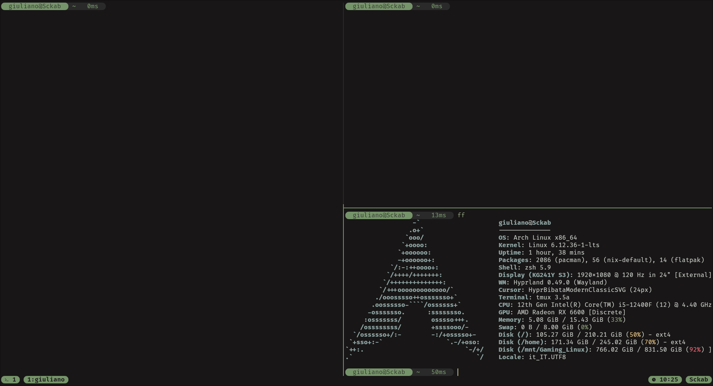

# TMUX-config

Personal configuration for [tmux](https://github.com/tmux/tmux), the terminal multiplexer. This repo provides an optimized configuration file to boost productivity, featuring handy shortcuts, a readable theme, and extra functionality through plugins.

## Features

- Fast navigation between panes and windows
- Colorful and readable themes
- Custom shortcuts for common operations
- Easy to extend and adapt to your workflow

## Installation

**Clone this repository:**

   ```sh
   git clone https://github.com/Sckab/TMUX-config.git ~/.config/tmux/
   ```

## Screenshot



## Customization

You can edit the `tmux.conf` file to adapt shortcuts, colors, and plugins to your preferences.

## Requirements

- [tmux](https://github.com/tmux/tmux) >= 2.6
- [git](https://git-scm.com/) for plugin management

## License

This project is licensed under the MIT License.

---

Contributions, suggestions, and bug reports are welcome!
